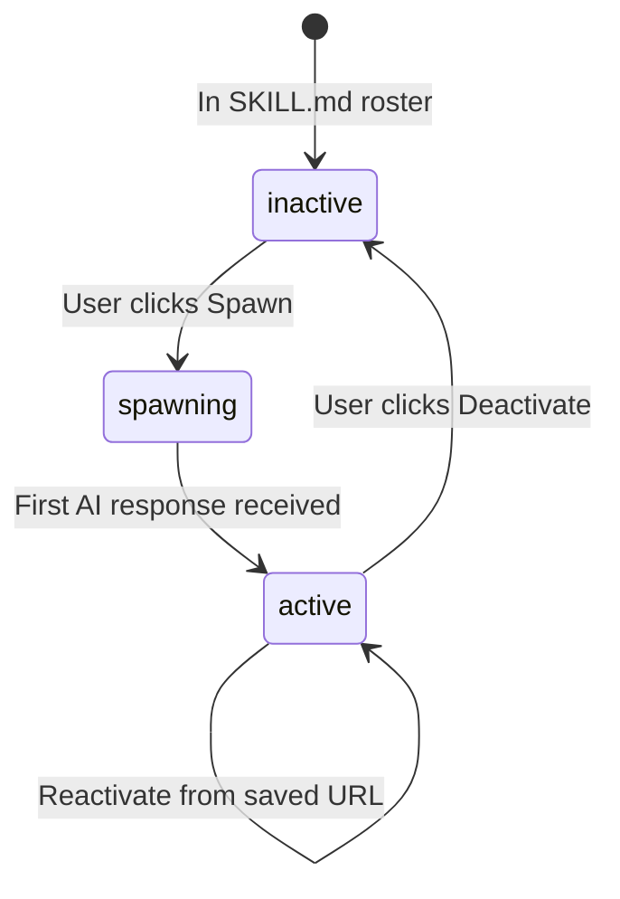

# XApply Documentation

> [!CAUTION]
> **READ BEFORE MAKING ANY CHANGES**
> 
> This codebase automates Google AI Studio. Selectors and timing are extremely sensitive. Changes can break the entire system.

---

## Documentation Index

| Document | Description |
|----------|-------------|
| [SELECTORS.md](./SELECTORS.md) | **CRITICAL** - All CSS/XPath selectors and why they matter |
| [flow_p1.md](./flow_p1.md) | Part 1: Chrome Launch & Profile Loading |
| [flow_p2.md](./flow_p2.md) | Part 2: Navigation & Login |
| [flow_p3.md](./flow_p3.md) | Part 3: Tab Monitor Setup |
| [flow_p4.md](./flow_p4.md) | Part 4: Popup Dismissal |
| [flow_p5.md](./flow_p5.md) | Part 5: Agent Database (SQLite) |
| [flow_p6.md](./flow_p6.md) | Part 6: Flask API Server |
| [flow_p7.md](./flow_p7.md) | Part 7: Frontend Integration |
| [flow_p8.md](./flow_p8.md) | Part 8: Spawn Agent Flow |
| [flow_p9.md](./flow_p9.md) | Part 9: Chat Flow & Response Capture |

---

## Architecture Overview

```
┌─────────────────┐     ┌─────────────────┐     ┌─────────────────┐
│    Frontend     │────▶│   Flask API     │────▶│  Chrome/Selenium│
│   (React/Vite)  │     │   (main.py)     │     │  (AI Studio)    │
└─────────────────┘     └─────────────────┘     └─────────────────┘
         │                      │                       │
         ▼                      ▼                       ▼
    localhost:5173         localhost:5000          WebDriver
```

---

## Key Files

| File | Purpose |
|------|---------|
| `backend/main.py` | Core automation engine |
| `backend/agents.db` | SQLite database for agent persistence |
| `frontend/api.ts` | API client for backend |
| `frontend/App.tsx` | Main React application |
| `.agent/skills/` | Agent skill definitions (SKILL.md files) |

---

## Critical Warnings

> [!WARNING]
> ### Never Change Without Testing
> - **Selectors**: AI Studio UI changes frequently
> - **Timing**: `time.sleep()` values are carefully calibrated
> - **Order**: Function call order in spawn_agent is critical

> [!WARNING]
> ### Tab Monitor
> The tab monitor runs in a background thread and closes popup tabs. Always:
> ```python
> pause_monitor()
> try:
>     # ... sensitive operations ...
> finally:
>     resume_monitor()
> ```

> [!WARNING]
> ### Settings Panel
> Model selection and System Instructions share the same panel:
> 1. `select_model(skip_close=True)` - Opens panel, keeps open
> 2. `set_system_instructions(skip_open=True)` - Uses open panel, closes it
> 3. Then uploads can proceed

---

## Agent Lifecycle



---

## Database Schema

```sql
CREATE TABLE agents (
    id TEXT PRIMARY KEY,
    name TEXT,
    description TEXT,
    status TEXT DEFAULT 'inactive',
    drive_url TEXT,
    google_email TEXT,
    files_uploaded TEXT,
    created_at TIMESTAMP DEFAULT CURRENT_TIMESTAMP
)
```

| Column | Purpose |
|--------|---------|
| `id` | Agent ID (e.g., "AI-CTX-001") |
| `name` | Display name from SKILL.md |
| `status` | inactive → spawning → active |
| `drive_url` | Saved URL for reactivation |

---

## API Endpoints

| Endpoint | Method | Purpose |
|----------|--------|---------|
| `/api/status` | GET | Health check |
| `/api/roster` | GET | All available agents from SKILL.md |
| `/api/agents` | GET | Active agents with window handles |
| `/api/spawn` | POST | Spawn or reactivate agent |
| `/api/deactivate` | POST | Close agent tab, mark inactive |
| `/api/chat` | POST | Send message, get response |

---

## Running the System

### Prerequisites
```bash
pip install flask flask-cors python-dotenv undetected-chromedriver selenium pyautogui pyperclip
```

### Start Backend
```bash
cd backend
python main.py
```

### Start Frontend
```bash
cd frontend
npm install
npm run dev
```

### Access
- Frontend: http://localhost:5173
- Backend API: http://localhost:5000

---

## Troubleshooting

| Issue | Cause | Solution |
|-------|-------|----------|
| Selector not found | UI changed | Update selector in main.py |
| Upload fails | Panel still open | Check function call order |
| Response empty | Reading too early | Check wait logic |
| Tab monitor closing tabs | Pause not called | Add pause_monitor() |
| Login required | Session expired | Delete chrome_profile, re-login |

---

## Contributing

1. **Never commit untested changes**
2. **Always capture new selector.html when UI changes**
3. **Document any new selectors in SELECTORS.md**
4. **Test full spawn → chat → deactivate cycle**

---

## License

Internal use only.
