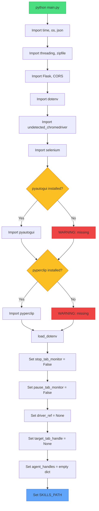
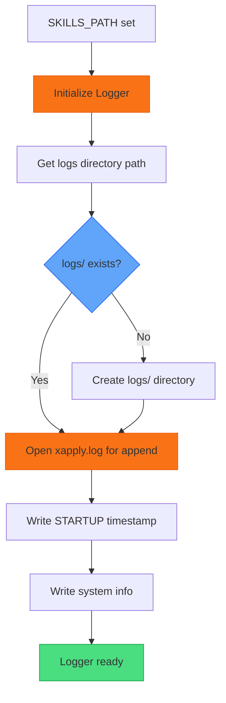

# XApply Flow - Part 1: Initialization & Logging

## Overview

| Part | Phases | What Happens |
|------|--------|--------------|
| **Part 1** | 1-2 | Import modules, setup logging |
| Part 2 | 3-4 | Chrome setup and launch |
| Part 3 | 5-6 | Extension and navigation |
| Part 4 | 7-9 | Popups, tab monitor, login |
| Part 5 | 10-12 | Agents, Flask, ready |

---

## Phase 1: Initialization



### Step-by-Step Explanation

| Step | What Happens | Why |
|------|--------------|-----|
| `python main.py` | Script starts | Entry point |
| Import standard libs | time, os, json, threading, zipfile | Basic Python utilities |
| Import Flask, CORS | Web framework | API server needs these |
| Import dotenv | Load .env file | Credentials stored in .env |
| Import chromedriver | undetected_chromedriver | Avoids bot detection |
| Import selenium | By, WebDriverWait, EC | Web automation |

### Required Dependencies

| Package | Purpose | If Missing |
|---------|---------|------------|
| `pyautogui` | Native dialogs, keyboard | **FAILS** - Cannot handle file dialogs |
| `pyperclip` | Clipboard paste | **FAILS** - Cannot paste credentials |

> **REQUIRED**: Both packages must be installed. Script will fail without them.

### Environment Variables (.env)

| Variable | Purpose | When Used |
|----------|---------|-----------|
| `GOOGLE_EMAIL` | Google account email | Auto-login if not logged in |
| `GOOGLE_PASSWORD` | Google account password | Auto-login if not logged in |

> **AUTO-LOGIN**: If no saved profile OR not logged in, script uses .env credentials to login automatically.

### Global Variables

| Variable | Initial Value | Purpose |
|----------|---------------|---------|
| `stop_tab_monitor` | False | Signal to stop monitor thread |
| `pause_tab_monitor` | False | Pause monitoring temporarily |
| `driver_ref` | None | Chrome driver reference |
| `target_tab_handle` | None | Main tab to protect |
| `agent_handles` | {} | Map agent ID to tab handle |
| `SKILLS_PATH` | .agent/skills | Where skill files are |

---

## Phase 2: Logging Setup



### Step-by-Step Explanation

| Step | What Happens | Log Entry |
|------|--------------|-----------|
| Initialize Logger | Create logger object | - |
| Get logs path | `./logs/` relative to backend | - |
| Check exists | Does logs/ folder exist? | - |
| Create if needed | `os.makedirs(logs, exist_ok=True)` | - |
| Open log file | Append mode to preserve history | - |
| Write STARTUP | `{"level": "INFO", "category": "STARTUP"}` | Timestamp, begin |
| Write system info | Python version, OS, cwd | Debug info |

### Logging Rules

| Output | Level | Content |
|--------|-------|---------|
| **File** (logs/xapply.log) | DEBUG | Everything - very detailed |
| **Terminal** | INFO | Important flow steps only |

### Log Format (JSON)

```json
{
  "timestamp": "2024-01-20T10:42:00Z",
  "level": "INFO",
  "category": "STARTUP",
  "message": "Backend starting",
  "data": {
    "python": "3.11.0",
    "os": "Windows",
    "cwd": "C:/Users/.../backend"
  }
}
```

---

## Color Key

| Color | Meaning |
|-------|---------|
| Green | Success / Start point |
| Yellow | Decision / Check |
| Red | Warning / Error path |
| Blue | Important check |
| Orange | Logging related |

---

## Next: Part 2

Part 2 covers **Phase 3-4**: Chrome Setup and Launch
