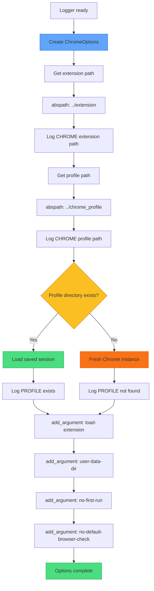
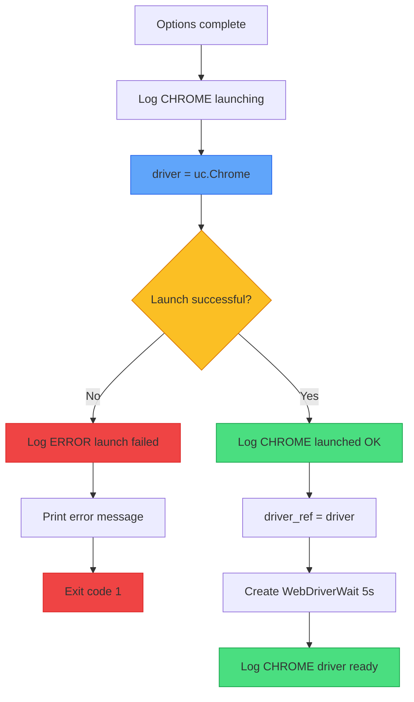
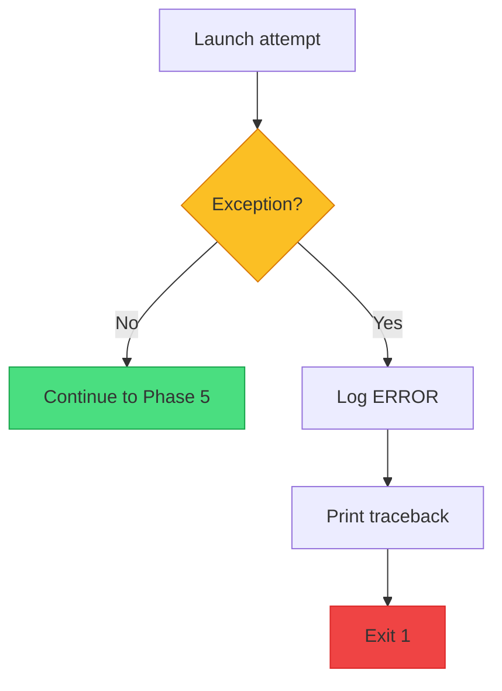

# XApply Flow - Part 2: Chrome Setup & Launch

## Overview

| Part | Phases | Status |
|------|--------|--------|
| Part 1 | 1-2 | Done |
| **Part 2** | 3-4 | **Chrome setup and launch** |
| Part 3 | 5-6 | Extension and navigation |
| Part 4 | 7-9 | Popups, tab monitor, login |
| Part 5 | 10-12 | Agents, Flask, ready |

---

## TODO / FIXES

> [!IMPORTANT]
> **Changes required in code**

| Item | Current | Change To | Status |
|------|---------|-----------|--------|
| WebDriverWait | 30s | **5s** | TODO |

---

## Phase 3: Chrome Setup

### Step-by-Step Explanation

| Step | Code | Purpose |
|------|------|---------|
| Create options | `uc.ChromeOptions()` | Container for Chrome settings |
| Extension path | `os.path.abspath("../extension")` | Browser extension location |
| Profile path | `os.path.abspath("../chrome_profile")` | Saved session location |
| Check profile | `os.path.exists(profile_path)` | Determine if session saved |

### Chrome Arguments

| Argument | Purpose |
|----------|---------|
| `--load-extension={path}` | Load our extension into Chrome |
| `--user-data-dir={path}` | Use saved profile for session |
| `--no-first-run` | Skip Chrome first-run wizard |
| `--no-default-browser-check` | Skip default browser popup |

### Profile Check Logic

| Profile Exists | What Happens |
|----------------|--------------|
| **Yes** | Load cookies, session, login state |
| **No** | Fresh Chrome, must login |

> **KEY**: Saved profile means faster startup - no login needed.

---

## Phase 4: Chrome Launch

### Step-by-Step Explanation

| Step | Code | Purpose |
|------|------|---------|
| Launch Chrome | `uc.Chrome(options=options)` | Start browser with settings |
| Check success | try/except block | Catch launch failures |
| Store reference | `driver_ref = driver` | Global access to driver |
| Create wait | `WebDriverWait(driver, 5)` | 5 second timeout for waits |

### Launch Errors

| Error | Cause | Action |
|-------|-------|--------|
| ChromeDriver not found | Missing chromedriver | Exit |
| Chrome not installed | No Chrome browser | Exit |
| Profile locked | Another Chrome using profile | Exit |
| Extension invalid | Bad extension path | Exit |

> **CRITICAL**: Any launch error = script exits. Cannot continue without Chrome.

---

## Error Handling

---

## Color Key

| Color | Meaning |
|-------|---------|
| Green | Success |
| Yellow | Decision |
| Red | Error/Exit |
| Blue | Action |
| Orange | First-time path |

---

## Next: Part 3

Part 3 covers **Phase 5-6**: Extension Load and Navigate to AI Studio
