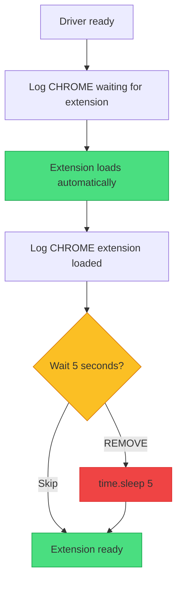
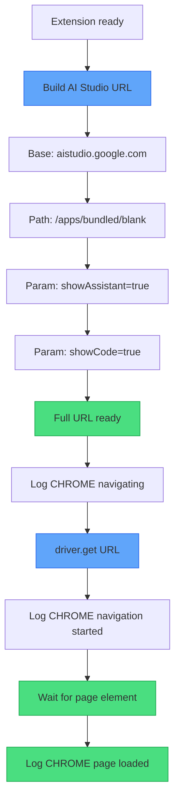

# XApply Flow - Part 3: Extension & Navigation

## Overview

| Part | Phases | Status |
|------|--------|--------|
| Part 1 | 1-2 | Done |
| Part 2 | 3-4 | Done |
| **Part 3** | 5-6 | **Extension and navigation** |
| Part 4 | 7-9 | Popups, tab monitor, login |
| Part 5 | 10-12 | Agents, Flask, ready |

---

## TODO / FIXES

> [!IMPORTANT]
> **Changes required in code**

| Item | Current | Change To | Status |
|------|---------|-----------|--------|
| Wait after extension | `time.sleep(5)` | **REMOVE** | TODO |
| Wait after navigation | `time.sleep(3)` | **Wait for element** | TODO |

---

## Phase 5: Extension Load



### Step-by-Step Explanation

| Step | What Happens | Log |
|------|--------------|-----|
| Extension loads | Chrome automatically loads extension from path | CHROME waiting |
| Extension ready | Extension scripts injected | CHROME loaded |
| Wait 5s | **REMOVE** - unnecessary delay | - |
| Continue | Proceed to navigation | - |

### Why Remove the 5s Wait?

| Reason | Explanation |
|--------|-------------|
| Unnecessary | Extension loads during Chrome startup |
| Slows startup | Adds 5 seconds to every launch |
| No benefit | No operations depend on this wait |

> **FIX**: Remove `time.sleep(5)` after extension load.

---

## Phase 6: Navigate to AI Studio



### AI Studio URL Construction

| Component | Value |
|-----------|-------|
| Base | `https://aistudio.google.com` |
| Path | `/apps/bundled/blank` |
| Param 1 | `?showAssistant=true` |
| Param 2 | `&showCode=true` |

**Full URL:**
```
https://aistudio.google.com/apps/bundled/blank?showAssistant=true&showCode=true
```

### Step-by-Step Explanation

| Step | Code | Purpose |
|------|------|---------|
| Build URL | String concatenation | Construct full URL |
| Navigate | `driver.get(url)` | Load the page |
| Wait for element | `WebDriverWait.until(element)` | Wait for page ready |
| Page loaded | Continue to popups | Ready for next phase |

### Wait for Element (Not Sleep)

| Old Way | New Way |
|---------|---------|
| `time.sleep(3)` | `wait.until(EC.presence_of_element_located(...))` |

> **FIX**: Replace `time.sleep(3)` with element wait. Faster and more reliable.

---

## Color Key

| Color | Meaning |
|-------|---------|
| Green | Success |
| Yellow | Decision |
| Red | Remove/Error |
| Blue | Action |

---

## Next: Part 4

Part 4 covers **Phase 7-9**: Popups, Tab Monitor, Login
