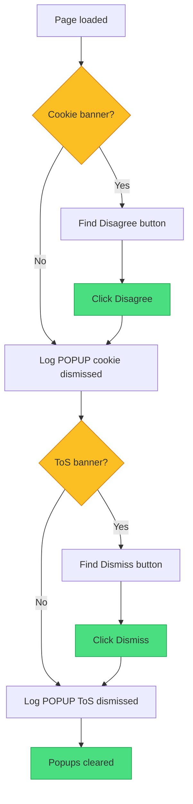
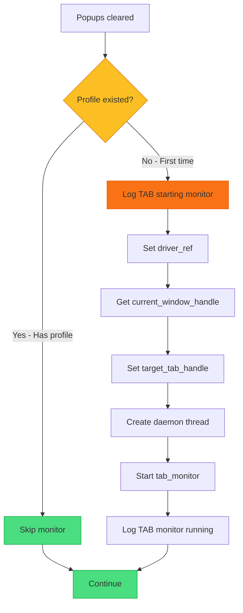
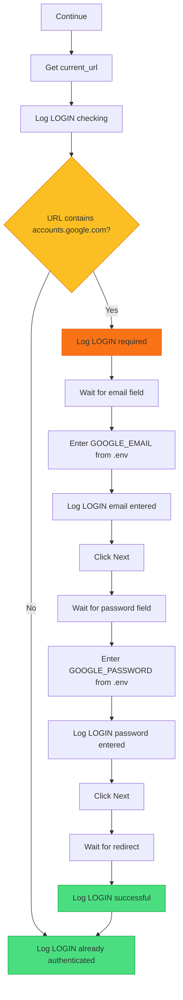

# XApply Flow - Part 4: Popups, Tab Monitor, Login

## Overview

| Part | Phases | Status |
|------|--------|--------|
| Part 1 | 1-2 | Done |
| Part 2 | 3-4 | Done |
| Part 3 | 5-6 | Done |
| **Part 4** | 7-9 | **Popups, tab monitor, login** |
| Part 5 | 10-12 | Agents, Flask, ready |

---

## TODO / FIXES

> [!IMPORTANT]
> **Changes required in code**

| Item | Current | Change To | Status |
|------|---------|-----------|--------|
| Tab monitor | Always runs | **First time only** | TODO |

---

## Phase 7: Dismiss Popups



### Popups to Handle

| Banner | Button | Selector |
|--------|--------|----------|
| Cookie consent | **Disagree** | Button text or aria-label |
| Terms of Service | **Dismiss** | Button text |

### Step-by-Step

| Step | Action | Log |
|------|--------|-----|
| Check cookie banner | Look for consent message | - |
| Click Disagree | Dismiss cookie popup | POPUP dismissed |
| Check ToS banner | Look for ToS notice | - |
| Click Dismiss | Dismiss ToS popup | POPUP dismissed |

> **NOTE**: Popups may not appear if profile has accepted before.

---

## Phase 8: Tab Monitor (First Time Only)



### When to Run Tab Monitor

| Scenario | Run Monitor? | Why |
|----------|--------------|-----|
| **First time** (no profile) | Yes | Close unwanted tabs during login |
| **Has profile** | No | Session clean, save memory |

### Tab Monitor Purpose

| What it Does | Why |
|--------------|-----|
| Loops every 0.5s | Check for new tabs |
| Detects unwanted tabs | Microsoft, Adobe, etc |
| Closes unwanted tabs | Keep browser clean |
| Protects target tab | Never close main tab |

### Memory Concern

> **WARNING**: Tab monitor runs continuously and consumes memory. Only run when needed (first time).

---

## Phase 9: Login Check



### Login Decision

| URL Check | Result |
|-----------|--------|
| Contains `accounts.google.com` | Need to login |
| Is AI Studio URL | Already logged in |

### Auto-Login Flow

| Step | Action | Data Source |
|------|--------|-------------|
| **Keep tab focused** | Ensure login tab stays active | - |
| Enter email | Type into email field | `GOOGLE_EMAIL` from .env |
| Click Next | Submit email | - |
| Enter password | Type into password field | `GOOGLE_PASSWORD` from .env |
| Click Next | Submit login | - |
| Wait redirect | Back to AI Studio | - |

> [!IMPORTANT]
> **Keep login tab focused** until login completes. Do not switch tabs during login.

### Required .env Variables

```
GOOGLE_EMAIL=your.email@gmail.com
GOOGLE_PASSWORD=your_password
```

> **SECURITY**: Never commit .env to git. Add to .gitignore.

---

## Color Key

| Color | Meaning |
|-------|---------|
| Green | Success / Skip |
| Yellow | Decision |
| Orange | First-time only |
| Blue | Action |

---

## Next: Part 5

Part 5 covers **Phase 10-12**: Agents, Flask, Ready
