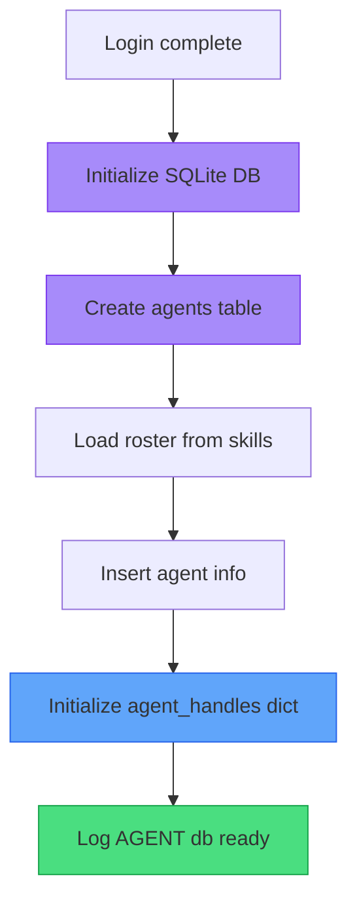
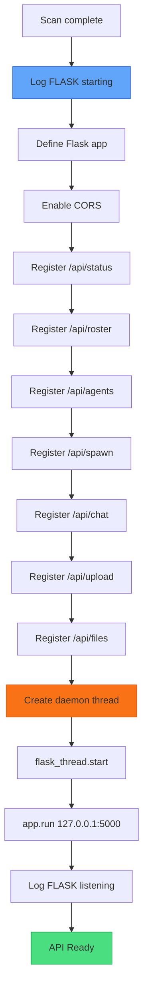
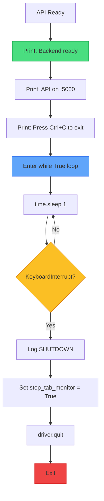

# XApply Flow - Part 5: Agents, Flask, Ready

## Overview

| Part | Phases | Status |
|------|--------|--------|
| Part 1 | 1-2 | Done |
| Part 2 | 3-4 | Done |
| Part 3 | 5-6 | Done |
| Part 4 | 7-9 | Done |
| **Part 5** | 10-12 | **Agents, Flask, ready** |

---

## TODO / FIXES

> [!IMPORTANT]
> **Changes required in code**

| Item | Current | Change To | Status |
|------|---------|-----------|--------|
| Agent storage | In-memory dict | **SQLite database** | TODO |

---

## Phase 10: Initialize Agent Database



### Storage Architecture

| Data | Where | Why |
|------|-------|-----|
| Agent INFO | **SQLite DB** | Persists across restarts |
| Tab handles | **Memory dict** | Chrome runtime only |

> **KEY**: Tab handles are Chrome runtime state - invalid after restart.

### SQLite Database Schema

```sql
CREATE TABLE agents (
    id TEXT PRIMARY KEY,
    name TEXT,
    description TEXT,
    status TEXT DEFAULT 'inactive',
    drive_url TEXT,
    google_email TEXT,
    files_uploaded TEXT,
    created_at TIMESTAMP DEFAULT CURRENT_TIMESTAMP
);
```

### Memory Dict (Runtime Only)

```python
agent_handles = {}  # Empty at startup
```

### State Flow

| Event | Database | Memory |
|-------|----------|--------|
| **Startup** | Reset ALL status='inactive', other data persists | `agent_handles = {}` empty |
| **Spawn** | Update status='active' | Add `agent_handles[id] = handle` |
| **Tab closed** | Update status='inactive' | Remove from `agent_handles` |
| **Restart** | Reset status='inactive', drive_url/email persist | `agent_handles` reset to `{}` |

### What Persists vs Resets

| Data | On Restart |
|------|------------|
| `id`, `name`, `description` | **Persists** |
| `drive_url` | **Persists** |
| `google_email` | **Persists** |
| `files_uploaded` | **Persists** |
| `status` | **Resets to 'inactive'** |
| `agent_handles` (memory) | **Resets to {}** |

### Example: After Restart

**Database (data persists, status reset):**
| id | status | drive_url | google_email |
|----|--------|-----------|--------------|
| CTO-001 | inactive | https://drive.google.com/... | user@gmail.com |
| AI-DIR-001 | inactive | null | null |

**Memory (always empty at startup):**
```python
agent_handles = {}
```

---

## Phase 11: Flask API Server



### API Endpoints

| Endpoint | Method | Purpose |
|----------|--------|---------|
| `/api/status` | GET | Backend health check |
| `/api/roster` | GET | List available agents |
| `/api/agents` | GET | List active agent tabs |
| `/api/spawn` | POST | Create new agent |
| `/api/chat` | POST | Send message to agent |
| `/api/upload` | POST | Upload file to agent |
| `/api/files` | GET | List uploaded files |

### Flask Configuration

| Setting | Value | Why |
|---------|-------|-----|
| Host | `127.0.0.1` | Local only |
| Port | `5000` | Backend port |
| Debug | `True` | **Development mode** |
| Reloader | `False` | Single instance |
| Daemon | `True` | Background thread |

> **DAEMON THREAD**: Flask runs in background so main thread can manage browser.

---

## Phase 12: Ready / Keep Alive



### Terminal Output

```
Browser + API ready!
API running on http://127.0.0.1:5000
Press Ctrl+C to exit
```

### Shutdown Sequence

| Step | Action |
|------|--------|
| Ctrl+C | User initiates shutdown |
| Stop monitor | Set `stop_tab_monitor = True` |
| Quit driver | `driver.quit()` closes Chrome |
| Exit | Script ends |

---

## Backend Complete

At this point:
- Chrome running with extension
- Profile loaded (or fresh login)
- Flask API listening on :5000
- Ready for frontend connection

---

## What Happens Next

```
BACKEND READY on :5000
        ↓
FRONTEND starts (npm run dev)
        ↓
Frontend calls GET /api/status
        ↓
Backend returns 200 OK
        ↓
Frontend shows ONLINE
```

---

## Color Key

| Color | Meaning |
|-------|---------|
| Green | Success |
| Yellow | Decision |
| Orange | Thread/Background |
| Blue | Action |
| Red | Exit/Shutdown |

---

## Summary: All Parts

| Part | Phases | Content |
|------|--------|---------|
| Part 1 | 1-2 | Initialization, Logging |
| Part 2 | 3-4 | Chrome Setup, Launch |
| Part 3 | 5-6 | Extension, Navigate |
| Part 4 | 7-9 | Popups, Tab Monitor, Login |
| Part 5 | 10-12 | Agents, Flask, Ready |
