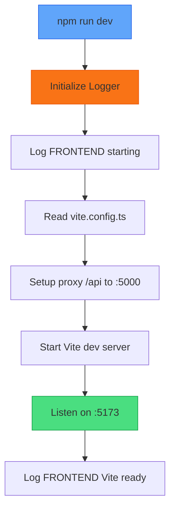
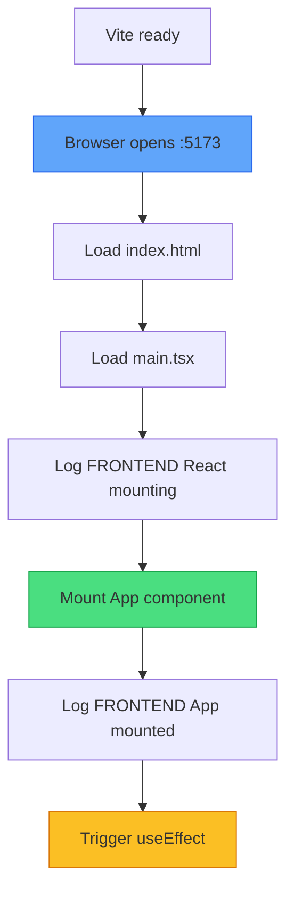
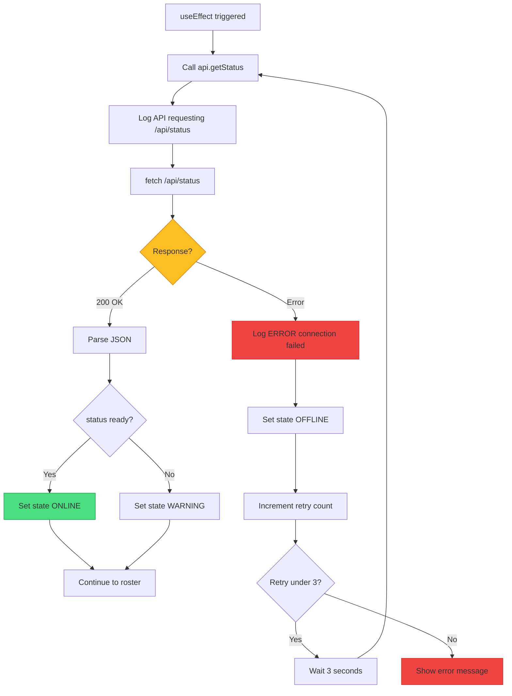

# XApply Flow - Part 6: Frontend Init & Status

## Overview

| Part | Phases | Status |
|------|--------|--------|
| Part 1-5 | 1-12 | Backend complete |
| **Part 6** | F1-F3 | **Frontend init, status** |
| Part 7 | F4-F5 | Roster, render |

---

## Frontend Startup Order

> [!IMPORTANT]
> **Backend MUST be running before frontend starts**

```
Backend ready on :5000
        ↓
npm run dev
        ↓  
Frontend starts on :5173
```

---

## Phase F1: Frontend Initialization



### What This Does

| Step | Purpose |
|------|---------|
| Initialize Logger | Setup console logging |
| Read config | Load vite.config.ts |
| Setup proxy | Forward /api/* to backend :5000 |
| Start Vite | Development server |
| Listen :5173 | Frontend port |

### Vite Proxy Configuration

```typescript
server: {
  proxy: {
    '^/api/': {
      target: 'http://127.0.0.1:5000',
      changeOrigin: true
    }
  }
}
```

> **WHY PROXY**: Frontend on :5173 can call /api/* which forwards to backend :5000.

---

## Phase F2: React Load



### What This Does

| Step | Purpose |
|------|---------|
| Browser opens | Navigate to localhost:5173 |
| Load index.html | Entry point |
| Load main.tsx | React entry |
| Mount App | Render root component |
| useEffect | Trigger API calls on mount |

---

## Phase F3: Status Check



### Status Check Logic

| Response | Action |
|----------|--------|
| 200 OK, status ready | Set ONLINE |
| 200 OK, status not ready | Set WARNING |
| Error/timeout | Set OFFLINE, retry |

### Retry Logic

| Attempt | Action |
|---------|--------|
| 1 | Try → Fail → Wait 3s |
| 2 | Try → Fail → Wait 3s |
| 3 | Try → Fail → Show error |

> **MAX RETRIES**: 3 attempts before showing error to user.

### API Response Format

```json
{
  "status": "ready",
  "driver_initialized": true
}
```

---

## Error States

| State | UI Shows | Cause |
|-------|----------|-------|
| ONLINE | Green indicator | Backend ready |
| WARNING | Yellow indicator | Backend starting |
| OFFLINE | Red indicator | Backend not running |

---

## Color Key

| Color | Meaning |
|-------|---------|
| Green | Success |
| Yellow | Decision/Warning |
| Orange | Logging |
| Blue | Action |
| Red | Error |

---

## Next: Part 7

Part 7 covers **Phase F4-F5**: Load Roster, Render UI
