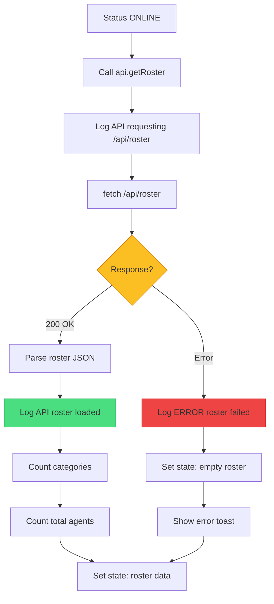
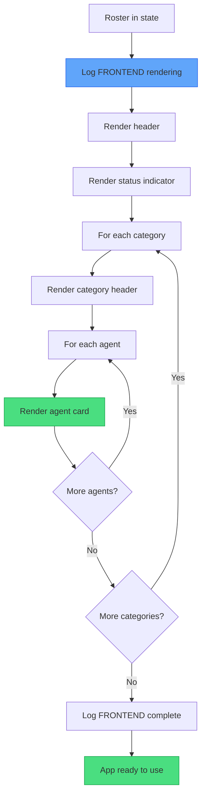

# XApply Flow - Part 7: Roster & Render

## Overview

| Part | Phases | Status |
|------|--------|--------|
| Part 1-5 | 1-12 | Backend complete |
| Part 6 | F1-F3 | Frontend init, status |
| **Part 7** | F4-F5 | **Roster, render** |

---

## Phase F4: Load Roster



### What This Does

| Step | Purpose |
|------|---------|
| Call getRoster | Fetch available agents |
| Parse JSON | Convert response to object |
| Count categories | Group agents by type |
| Set state | Store in React state |

### API Response Format

```json
{
  "AI": [
    {"id": "AI-DIR-001", "name": "Director of AI/ML", "status": "inactive"},
    {"id": "AI-ENG-001", "name": "ML Engineer", "status": "inactive"}
  ],
  "Backend": [
    {"id": "BE-DIR-001", "name": "Director of Backend", "status": "inactive"}
  ],
  "Frontend": [
    {"id": "FE-DIR-001", "name": "Director of Frontend", "status": "inactive"}
  ]
}
```

### Error Handling

| Error | Action |
|-------|--------|
| Network error | Show empty grid + toast |
| 500 error | Show empty grid + toast |
| Timeout | Show empty grid + toast |

> **NOTE**: App still usable with empty roster - user can retry.

---

## Phase F5: Render UI



### UI Components

| Component | Purpose |
|-----------|---------|
| Header | App title, status |
| Status indicator | ONLINE/OFFLINE badge |
| Category header | Group name (AI, Backend, etc) |
| Agent card | Agent info + spawn button |

### Agent Card Contents

| Field | Source |
|-------|--------|
| ID | `agent.id` |
| Name | `agent.name` |
| Status | Badge (inactive/active) |
| Spawn button | Calls `/api/spawn` |

---

## App Ready State

At this point:
- Backend running on :5000
- Frontend running on :5173
- Status showing ONLINE
- Roster displayed
- Ready for user interaction

---

## User Actions Available

| Action | API Call | Result |
|--------|----------|--------|
| Click Spawn | POST `/api/spawn` | New agent tab opens |
| Click Agent | - | Select agent |
| Send Chat | POST `/api/chat` | Message sent to agent |
| Upload File | POST `/api/upload` | File sent to agent |

---

## Complete Startup Summary

```
BACKEND (python main.py)
├── Phase 1-2: Init, Logging
├── Phase 3-4: Chrome Setup, Launch
├── Phase 5-6: Extension, Navigate
├── Phase 7-9: Popups, Tab Monitor, Login
├── Phase 10-12: Agents DB, Flask, Ready
└── API Ready on :5000

FRONTEND (npm run dev)
├── Phase F1: Vite Init
├── Phase F2: React Load
├── Phase F3: Status Check
├── Phase F4: Load Roster
├── Phase F5: Render UI
└── App Ready on :5173
```

---

## Color Key

| Color | Meaning |
|-------|---------|
| Green | Success |
| Yellow | Decision |
| Blue | Action |
| Red | Error |

---

## All Parts Complete

| Part | Content |
|------|---------|
| 1 | Initialization, Logging |
| 2 | Chrome Setup, Launch |
| 3 | Extension, Navigate |
| 4 | Popups, Tab Monitor, Login |
| 5 | Agents DB, Flask, Ready |
| 6 | Frontend Init, Status |
| 7 | Roster, Render |
