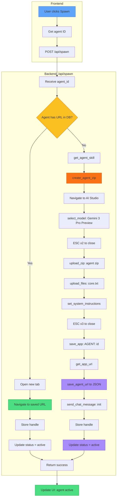

# XApply Flow - Part 8: Spawn Agent

## Trigger

User clicks **Spawn** button on agent card.

---

## Complete Flow



---

## Reactivation (if URL exists in DB)

| Step | Action |
|------|--------|
| Check DB | Agent has `drive_url`? |
| Open tab | New Chrome tab |
| Navigate | Go to saved URL |
| Store handle | `agent_handles[id] = handle` |
| Update status | `active` |
| Return | Skip all other steps |

> **FAST PATH**: If spawned before, just open saved URL.

---

## Agent Zip Contents

`create_agent_zip()` creates `{agent_id}.agent.zip` containing:

| File | Content |
|------|---------|
| `core_instructions.md` | Skill content from SKILL.md |
| `input.md` | "# Input\n\nAwaiting input..." |
| `output.md` | Output format template |
| `memory.json` | `{}` empty JSON |

> **NOTE**: input.md, output.md, memory.json are IN the zip, not uploaded separately.

---

## Files Uploaded

| # | File | How |
|---|------|-----|
| 1 | `{agent_id}.agent.zip` | `upload_zip()` |
| 2 | `core.txt` | `upload_files()` (if exists) |

---

## Settings Configuration

| Step | Function | Details |
|------|----------|---------|
| Model | `select_model()` | "Gemini 3 Pro Preview" |
| Close | ESC x2 | pyautogui |
| System Instructions | `set_system_instructions()` | Paste skill content |
| Close | ESC x3 | pyautogui |

---

## Save App

| Step | Action | Selector |
|------|--------|----------|
| Click Save | `save_app()` | `//button[@aria-label='Save app']` |
| Dialog opens | Wait | - |
| Enter name | Type | `#name-input` → "AGENT: {id}" |
| Confirm | Click | Primary button in dialog |
| Get URL | `get_app_url()` | `driver.current_url` |
| Save URL | `save_agent_url()` | To `agents.json` |

---

## Init Message

`send_chat_message()` sends:

```
First, analyze core.txt to understand the full project context.

Then read your core_instructions.md file to understand your role.

You are {name}.
{description}

CRITICAL: Write ALL responses to output.md file, NOT in chat.

Format:
STATUS: [READY|PROCESSING|COMPLETE|ERROR]
TASK_ID: [task identifier]
RESULT: [your response]

Confirm by editing output.md with STATUS: READY.
```

---

## State After Spawn

| Storage | Before | After |
|---------|--------|-------|
| `agent_handles` | `{}` | `{"CTO-001": handle}` |
| `status` | inactive | **active** |
| `agents.json` | - | Contains URL |

---

## Error Handling

| Phase | Error | Action |
|-------|-------|--------|
| get_agent_skill | Not found | Return False |
| create_agent_zip | Failed | Return False |
| upload_zip | Failed | Return False |
| save_app | Failed | Continue (logged) |
| send_chat_message | Failed | Continue (logged) |

---

## Next: Part 9

Part 9 covers **Chat Flow**
