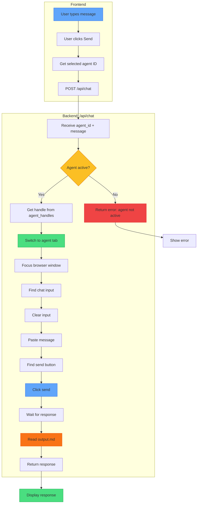

# XApply Flow - Part 9: Chat (Single Agent)

## Trigger

User types message and clicks **Send** in frontend.

---

## Complete Flow



---

## Frontend Actions

| Step | Action |
|------|--------|
| 1 | User types message in chat input |
| 2 | User clicks Send button |
| 3 | Get currently selected agent ID |
| 4 | POST `/api/chat` with `{agent_id, message}` |
| 5 | Wait for response |
| 6 | Display response in chat UI |

---

## Backend Actions

### Phase 1: Validate Agent

| Step | Action |
|------|--------|
| Receive | `agent_id` and `message` from request |
| Check | Is agent in `agent_handles`? |
| If No | Return error: "Agent not active" |
| If Yes | Continue |

### Phase 2: Switch to Agent Tab

| Step | Action |
|------|--------|
| Get handle | `agent_handles[agent_id]` |
| Switch | `driver.switch_to.window(handle)` |
| Focus | `window.focus()` |

### Phase 3: Send Message

| Step | Action | Selector |
|------|--------|----------|
| Find chat input | Wait for textarea | `div.input-container textarea` |
| Click to focus | Activate input | Click element |
| Clear | Remove existing text | Ctrl+A, Delete |
| Paste message | Insert user message | Ctrl+V (clipboard) |
| Find send | Locate button | `button.send-button` |
| Click send | Submit message | Click element |

### Phase 4: Get Response

| Step | Action |
|------|--------|
| Wait | Agent processes message |
| Check output.md | Agent writes response to output.md |
| Read output.md | Get response content |
| Parse | Extract STATUS and RESULT |
| Return | Send response to frontend |

---

## output.md Format

Agent writes responses to `output.md`:

```markdown
STATUS: COMPLETE
TASK_ID: chat-001
RESULT: Here is my response to your question...
```

| Field | Values |
|-------|--------|
| STATUS | READY, PROCESSING, COMPLETE, ERROR |
| TASK_ID | Identifier for this task |
| RESULT | The actual response content |

---

## API Details

### Request

```
POST /api/chat
Content-Type: application/json

{
  "agent_id": "CTO-001",
  "message": "How should we structure the API?"
}
```

### Response (Success)

```json
{
  "success": true,
  "agent_id": "CTO-001",
  "response": "Here is my recommendation...",
  "status": "COMPLETE"
}
```

### Response (Error)

```json
{
  "success": false,
  "error": "Agent not active"
}
```

---

## Element Selectors

| Element | Selectors (with fallbacks) |
|---------|---------------------------|
| Chat container | `div.input-container`, `.chat-input`, `ms-autosize-textarea` |
| Textarea | `div.input-container textarea`, `ms-autosize-textarea textarea`, `textarea[placeholder*='message']` |
| Send button | `button.send-button`, `button[aria-label*='Send']`, `button[data-test-id='send-button']` |

---

## Error Handling

| Error | Cause | Action |
|-------|-------|--------|
| Agent not active | Not in agent_handles | Return error |
| Tab switch failed | Handle invalid | Remove from handles, return error |
| Input not found | UI changed | Retry with fallbacks |
| Send failed | Button not found | Return error |
| Response timeout | Agent stuck | Return timeout error |

---

## State During Chat

| State | Value |
|-------|-------|
| Selected agent | User's choice in UI |
| Active tab | Switched to agent's tab |
| agent_handles | Unchanged |
| status | Unchanged (still active) |

---

## Next: Part 10

Part 10 covers **Broadcast Flow** - sending to all agents
